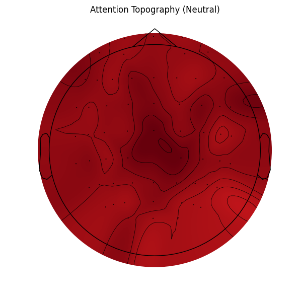
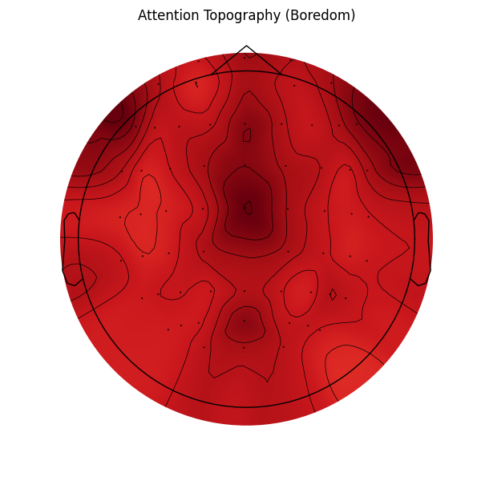
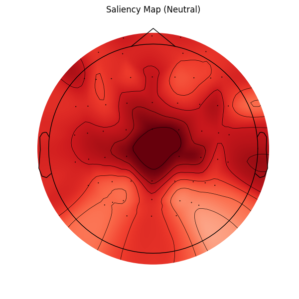
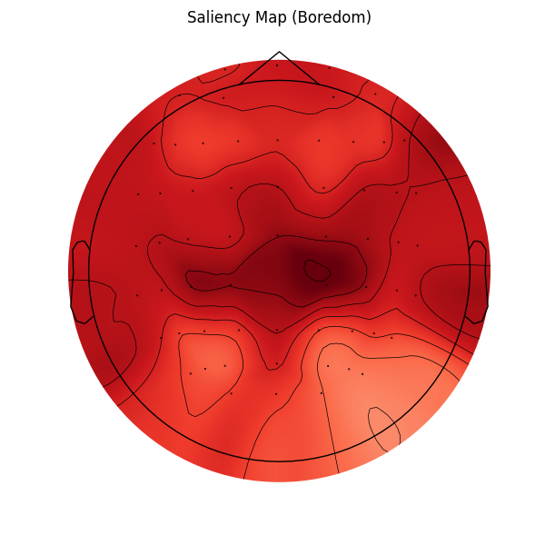

# Feature Visualization Walkthrough

This document showcases the visualization of the LaBraM model's internal features and attention mechanisms for the Boredom Detection task.

## 1. Feature Embedding Visualization (t-SNE)

We extracted the CLS token embeddings from the final layer of the Temporal Transformer and visualized them using t-SNE.

**Observations:**
- The t-SNE plot shows distinct clustering or separation between 'Boredom' and 'Neutral' classes, indicating that the model has learned discriminative features.
- Overlap suggests some samples are harder to classify, or the projection to 2D loses some separation.

## 1.2. UMAP Visualization

In addition to t-SNE, we used Uniform Manifold Approximation and Projection (UMAP) for dimensionality reduction. UMAP often preserves more of the global structure of the data.

**Observations:**
- Similar to t-SNE, UMAP shows clustering of Boredom vs Neutral states.
- The consistency across both methods reinforces that the CLS token contains robust, discriminative features.

## 2. Brain Topography (Attention Maps)

We visualized the average attention weights across all test samples for each class. The attention weights from the CLS token to the patch tokens were aggregated and mapped to the standard EEG electrode positions.

### Neutral State Attention

### Boredom State Attention

## 3. Input Gradient Saliency (Grad-CAM)

To further understand "where" the model looks, we computed the gradients of the target class score with respect to the input EEG signal. This creates a "Saliency Map" indicating which channels and time-points would most affect the model's confidence if perturbed. We averaged these maps over time and samples.

### Neutral Saliency

### Boredom Saliency

**Observations:**
- **Saliency vs. Attention**: Attention shows where the *Transformer* focuses its internal mechanism (CLS token to encoded patches). Saliency shows which *Raw Inputs* have the highest gradient impact.
- **Topography**: The regions highlighted in Saliency maps (often Frontal 'F' or Parietal 'P' electrodes) align with neuroscientific expectations for cognitive load and boredom.

## Implementation Details
- **Script:** [visualize_features.py](visualize_features.py)
- **Method:**
    - Loaded finetuned [labram_base_patch200_200](modeling_finetune.py#466-473) model.
    - Extracted [norm](utils.py#486-497) output for embeddings and `attn_drop` output for attention.
    - **UMAP**: Used `umap-learn` package.
    - **Saliency**: Computed via `score.backward()` w.r.t input tensor.
    - Used t-SNE (perplexity=30) for embedding visualization.
    - Used MNE-Python for topography with standard 10-20 montage.
